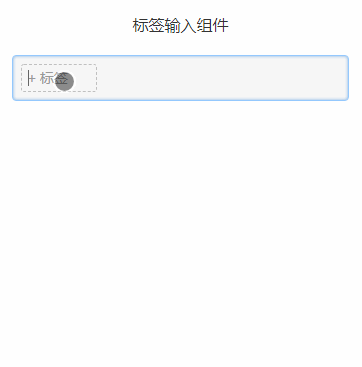
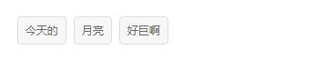
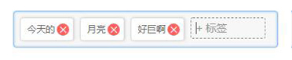
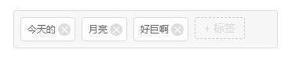
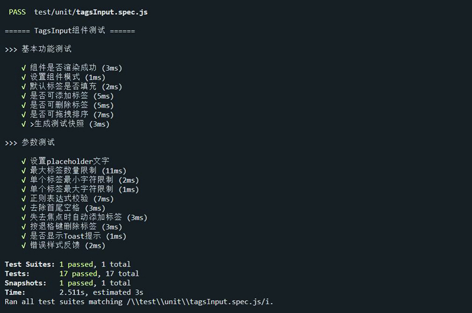
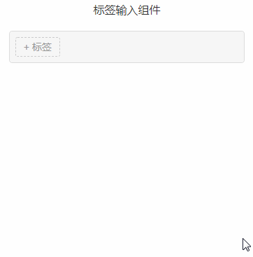

<p align="center">
  
  
</p>

> *A vue component for web developers.*
> 标签输入组件，基于vue编写，用于web表单页面，支持移动端。

------

<br>

### 一、使用示例



### 二、组件功能

- 3种模式【展示模式，编辑模式，禁用模式】
  - 展示模式下，可查看标签（仅标签样式）<br>
    
  - 编辑模式下，可查看可编辑<br>
    
  - 禁用模式下，可查看（保留编辑状态下所有样式）<br>
    
- 添加标签，支持按Enter添加、失去焦点自动添加、函数方式添加；
- 删除标签，支持按钮删除和按Backspace退格键删除；
- 标签排序，开启排序后，可对已存在的标签进行拖拽排序；
- 支持单个标签值的正则限制和单独参数限制；
- 支持toast提示和错误样式展示；
- 支持传入默认标签；
- 可扩展模块```<slot name="extra"></slot>```。

### 三、组件参数及事件

**参数**

| 参数                | 说明                                                         | 类型    | 默认值   |
| ------------------- | :----------------------------------------------------------- | ------- | -------- |
| mode                | 组件模式 [ 0-展示模式，1-编辑模式，2-禁用模式 ]              | Number  | 1        |
| max                 | 最大标签个数                                                 | Number  | null     |
| minChar             | 单个标签最少字数                                             | Number  | 1        |
| maxChar             | 单个标签最大字数                                             | Number  | null     |
| pattern             | 标签规则，正则匹配（可能会与minChar，maxChar，trimValue冲突，不推荐混用） | RegExp  | null     |
| patternTip          | 正则错误提示文案，用于pattern参数                            | String  | ""       |
| sortable            | 是否可拖动排序                                               | Boolean | true     |
| trimValue           | 是否需要清除首尾空格                                         | Boolean | false    |
| addOnblur           | 是否在失去焦点时候添加标签                                   | Boolean | false    |
| removeWithBackspace | 是否使用退格键删除                                           | Boolean | true     |
| showToast           | 是否显示toast提示                                            | Boolean | true     |
| errorTip            | 是否显示错误样式                                             | Boolean | true     |
| errorCls            | 错误样式类名，可外部定义                                     | String  | "error"  |
| placeholderText     | placeholder文案                                              | String  | "+ 标签" |


**change(data)**：组件数据改变之后触发，返回最新的标签数据。

```javascript
{
    type: 'add', // 触发类型['add'：添加，'delete'：删除，'sort'：排序，'empty'：清空]
    current: 'add', // 当前操作的值
    data: ['标签一'], // 标签数据
    backSpace: true // 是否使用退格键删除
}
```

**函数方法** —— 可通过this.$refs.tagsInput.fn()调用：

- 添加标签：setItem(value, index)，[ value：标签值，index：插入的位置索引 ]
- 删除标签：removeItem(tag)，[ tag：标签索引或标签值 ]
- 清空标签：empty()
- 获取标签数据：getData()
- 禁用组件：disable()

### 四、使用方法

1、使用npm 下载组件到项目中，引入即可使用

> npm install -s @babychin/vue-tags-input

```javascript
import TagsInput from "@babychin/vue-tags-input"

export default {
  name: "app",
  components: { TagsInput },
  data() {
    return {
      tagsConfig: {
        max: 5, 
        showToast: true, 
        pattern: /^.{3,6}$/, 
        sortable: true
      }, 
      tagsData: ["今天的","月亮","好巨啊"], // 标签数据
    };
  },
  mounted() {
    // this.$refs.tagsInput.setItem("好帅的快递哥哥");
    // this.$refs.tagsInput.removeItem("好帅的快递哥哥");
  },
  methods: {
    /**
     * 标签数据改变
     */
    tagsChange(data) {
      console.log("最新的标签数据：", data);
    }
  }
};
```


```javascript
<tags-input :config = "tagsConfig" v-model="tagsData" @change="tagsChange"  ref="tagsInput"/>
```


2、普通html中直接引入使用

```html
<!DOCTYPE html>
<html lang="en">
<head>
  <meta charset="utf-8">
  <title>tags-input</title>
  <script src="https://cdn.staticfile.org/vue/2.4.2/vue.min.js"></script>
  <script src="../dist/tagsInput.umd.js"></script>
</head>
<body>
  <div id="app">
    <tags-input></tags-input>
  </div>
  <script>
    new Vue({
      el: '#app'
    })
  </script>
</body>
</html>
```

### 五、项目相关操作

- 安装依赖： `npm install`
- 运行组件demo（serve with hot reload at localhost:3000）：`npm start`
- 单元测试（基于Jest + vue-test-utils ）：`npm test`
- 浏览器UI可视化测试（基于puppeteer，需要安装puppeteer(npm install puppeteer --ignore-scripts),并下载[chromium浏览器](https://download-chromium.appspot.com/)放在test/chrome/目录下）：`npm run browser`
- 组件打包，输出用于生产环境的文件（包含esm，amd，cmd，umd规范）：`npm run build`

### 单元测试结果（PASSED）



### 浏览器UI可视化测试（演示）



### 感激

感谢以下的项目，排名不分先后

- [vue](https://cn.vuejs.org/) 
- [vue-test-utils](https://vue-test-utils.vuejs.org/) 
- [puppeteer](https://zhaoqize.github.io/puppeteer-api-zh_CN/#/?id=%E6%A6%82%E8%BF%B0) 
- [sortable](http://rubaxa.github.io/Sortable/)

### 版权

— MIT License —
